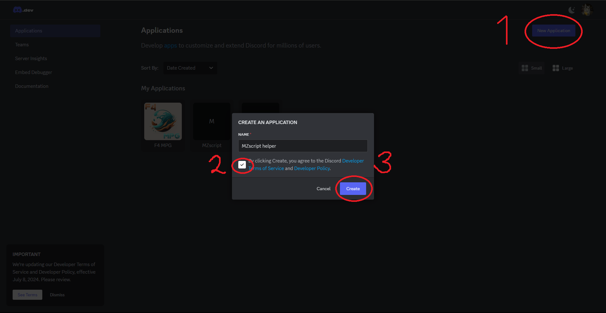
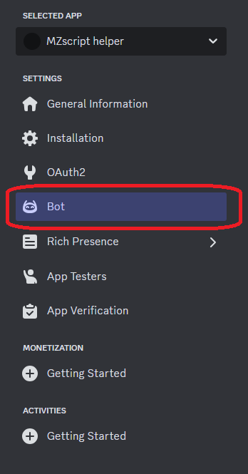
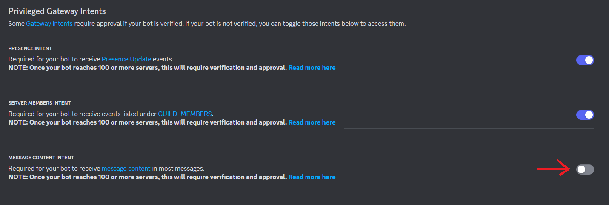
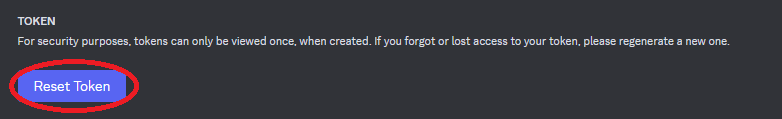
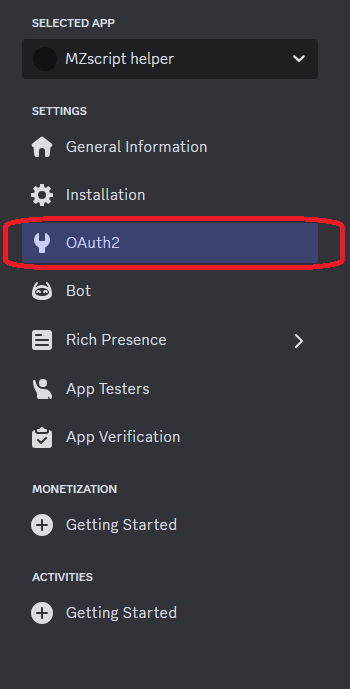
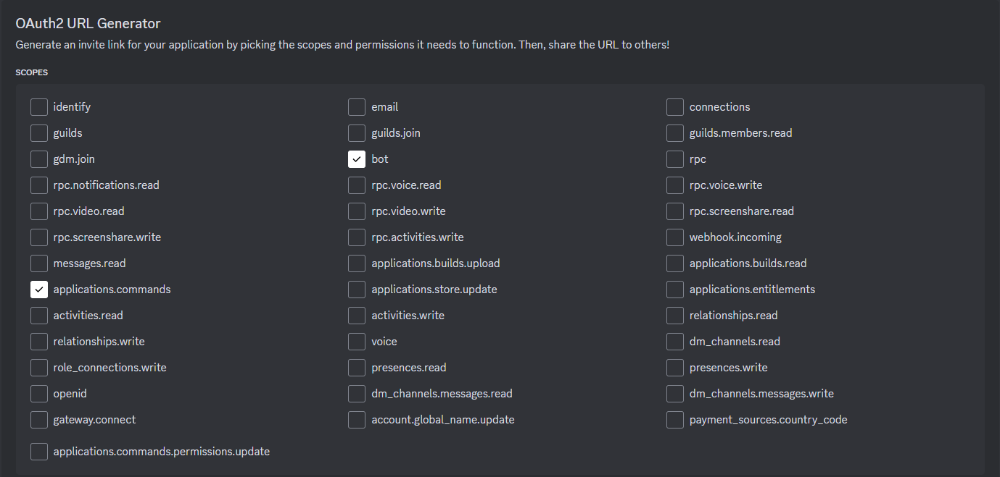
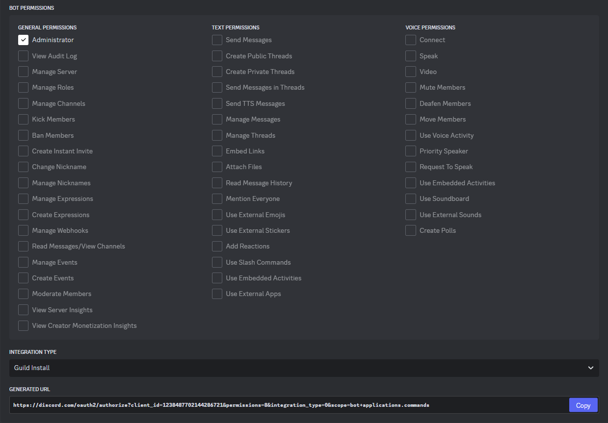
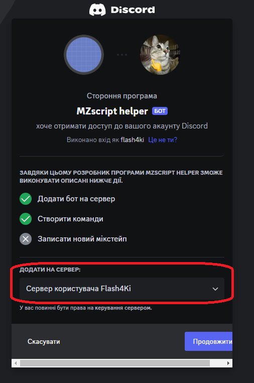

# Create Bot

## Create bot in Discord Developers Portal

> Go to **[Discord Developers Portal](https://discord.com/developers/applications/)**

> Go to **Bot**

> **Turn on all Intents**

### Getting Token

> **DONT SHOW YOU TOKEN**

### Invite you bot

> Go to **Oauth2**

> Copy **"generated url"**

> Choose you server

