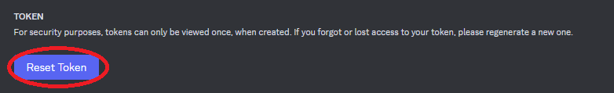
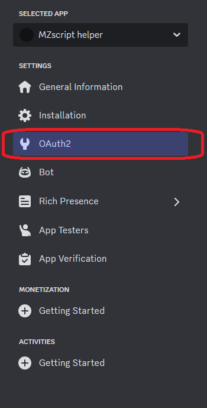
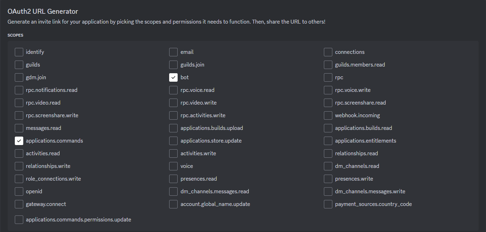

# Создаем бота

## Создаем бота на сайте Discord Developers Portal

> Переходим **[Discord Developers Portal](https://discord.com/developers/applications/)**

> Заходим в **Bot**

> **Включаем все интенты**

### Берем токен

> **НИКОМУ НИКОГДА НЕ ПОКАЗЫВАЙТЕ ТОКЕН**

### Приглашаем бота

> Заходим в **Oauth2**

> Копируем **"generated url"**

> Выбираем нужен сервер

